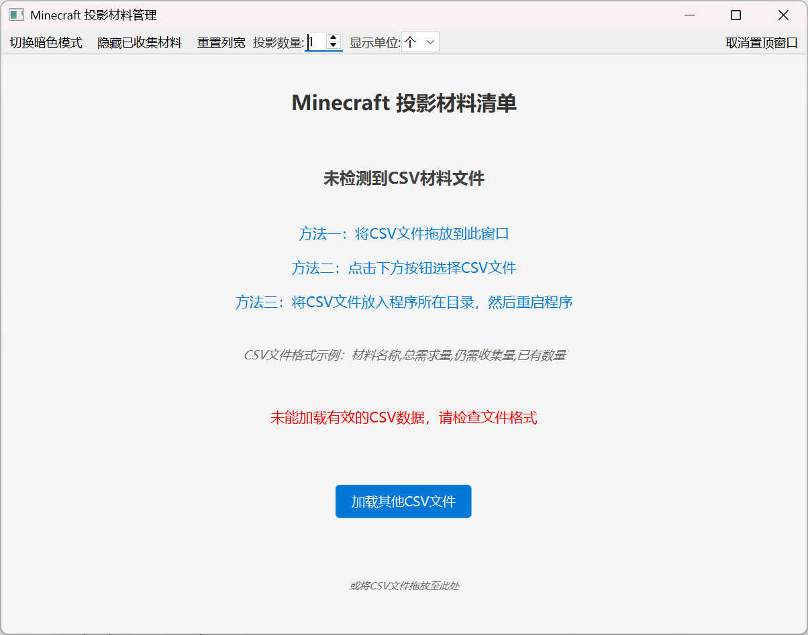
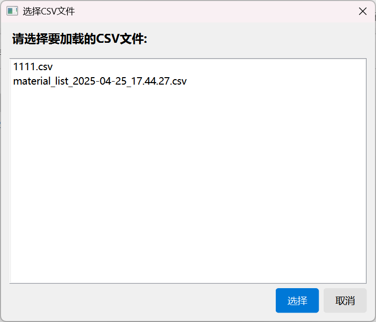
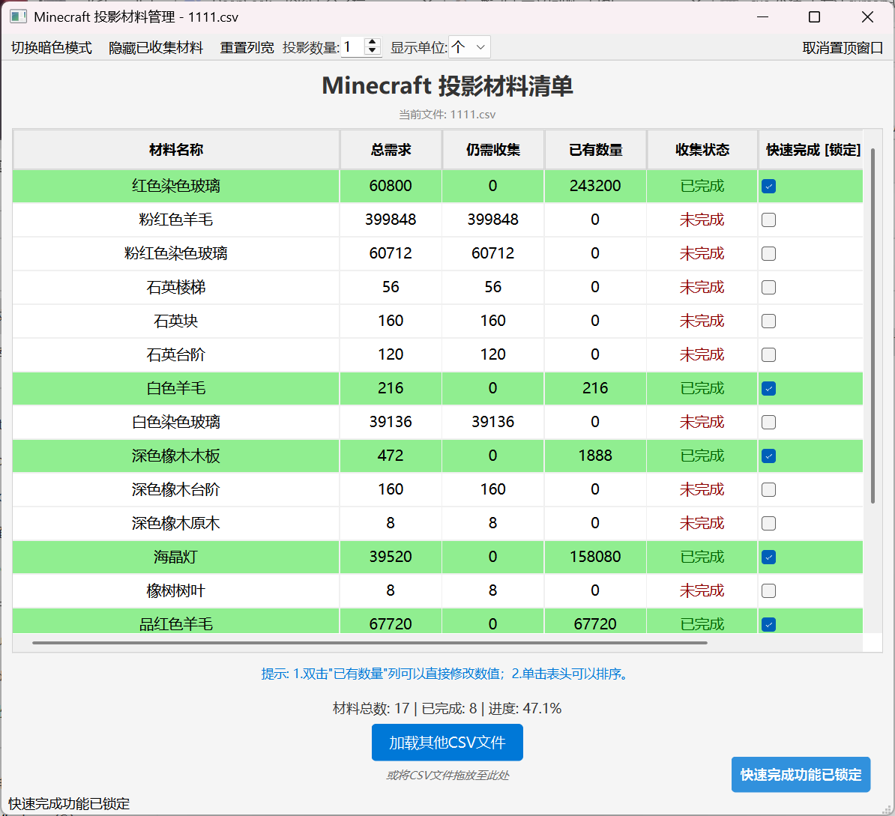
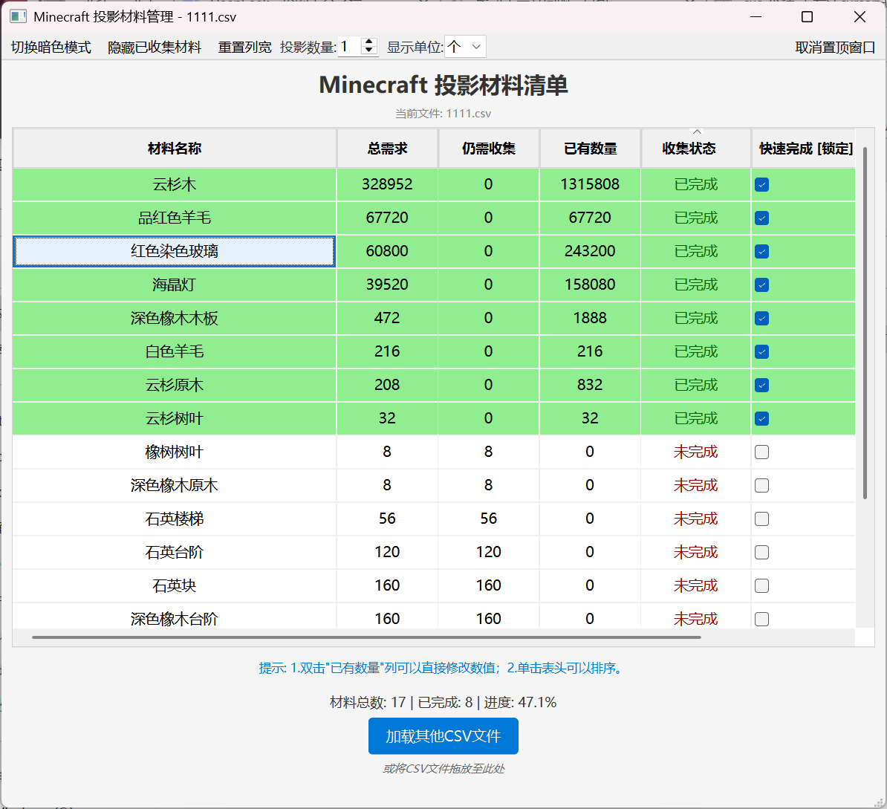
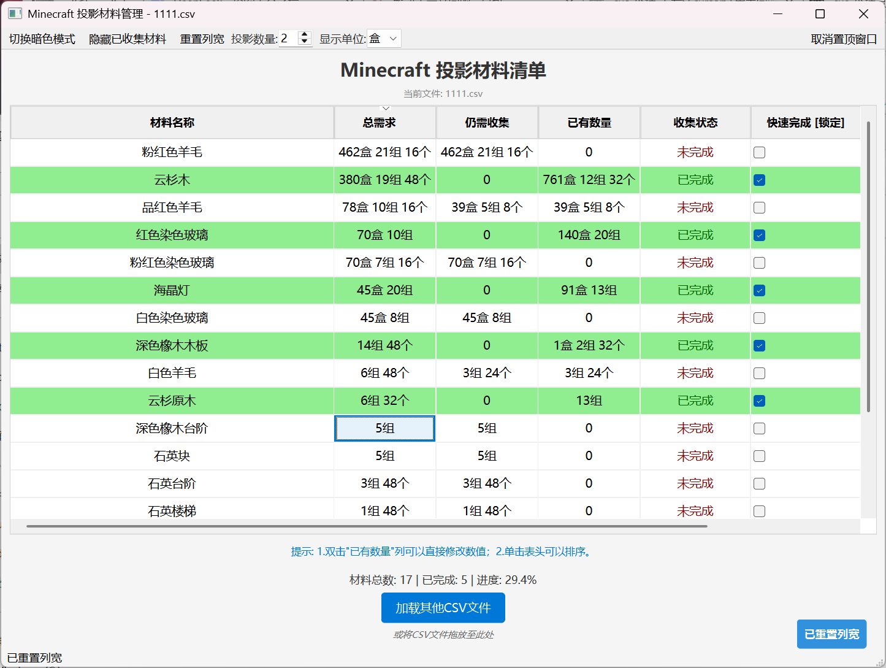

# Minecraft 投影材料管理工具

一个基于 PySide6 的图形化工具，旨在帮助 Minecraft 玩家（特别是使用投影 Mod，如 Litematica 的玩家）更方便地追踪和管理所需材料的收集进度。

## 主要功能概览

- **CSV 加载与管理**:
  - 支持通过拖放、文件选择按钮或自动检测程序同目录下 CSV 文件的方式加载材料清单。
  - **可直接加载由 Minecraft 投影模组（如 Litematica）导出的材料列表 CSV 文件**。
  - 若目录下有多个 CSV 文件，会弹出对话框供用户选择。
  - 编辑后的数据会 **实时保存** 回原 CSV 文件，并创建备份 (`.bak`)。
- **直观的表格显示**:
  - 清晰展示材料名称、总需求量、仍需收集量、已有数量和收集状态。
  - 自动根据“总需求”和“已有数量”计算“仍需收集量”。
  - 高亮显示已完成收集的材料行（绿色背景）。
- **便捷的交互操作**:
  - **直接编辑**: 双击“已有数量”列的单元格可直接修改数值。
  - **快速完成**: “快速完成”列提供复选框，勾选后自动将该材料的“已有数量”设置为“总需求”，并标记为完成。
  - **单击排序**: 单击“材料名称”、“总需求”、“仍需收集”、“已有数量”、“收集状态”的表头可进行排序（首次单击降序，再次单击升序）。
  - **锁定快速完成**: 单击“快速完成”列的表头可切换该列的锁定状态，锁定后无法使用快速完成功能，列背景变灰，表头文本和 Tooltip 会提示当前状态。
  - **列宽调整**: 支持拖动表头分隔线调整列宽，并可通过工具栏按钮重置为默认宽度。
- **投影与单位支持**:
  - **多投影计算**: 可在工具栏调整“投影数量”（1-10 个），“总需求”和“仍需收集”会相应更新，同时保留您已输入的“已有数量”。
  - **多单位显示**: 可在工具栏选择以“个”、“组”（64 个/组）或“盒”（27 组/盒）为单位显示数量列（总需求、仍需收集、已有数量），方便对照游戏内习惯。
- **视图与过滤**:
  - **隐藏已收集**: 可通过工具栏按钮切换是否隐藏已收集完成的材料行。
  - **主题切换**: 支持亮色和暗色主题切换。
  - **窗口置顶**: 可通过工具栏按钮切换窗口是否保持在所有其他窗口之上。
- **状态持久化**:
  - 自动保存上次使用的主题、隐藏/显示已收集状态、窗口置顶状态以及选择的显示单位。

## 如何使用

1.  **在 Minecraft 中导出材料列表**:
    - 使用您的投影模组（例如 Litematica）的功能，将当前投影所需的材料列表导出为 `.csv` 文件。通常模组设置或命令中会有相关选项。
2.  **运行程序**:
    - 如果直接下载可执行文件 (`.exe`)，双击运行即可。
    - 如果从源代码运行，请确保安装了必要的 Python 库（主要是 `PySide6` 和 `pandas`），然后执行 `python "Minecraft 投影材料管理工具.py"`。
3.  **加载 CSV 文件**:
    - **自动加载**: 将您从游戏中导出的材料清单 CSV 文件放在程序 (`.exe` 或 `.py`) 所在的目录下。如果只有一个 CSV 文件，程序启动时会自动加载。如果有多个，会弹出选择框。
    - **拖放加载**: 将 CSV 文件直接拖放到程序窗口内。
    - **按钮加载**: 点击窗口底部的“加载其他 CSV 文件”按钮，在弹出的对话框中选择文件。
4.  **界面交互**:
    - **修改数量**: 双击“已有数量”单元格输入数字。
    - **快速完成**: 勾选或取消勾选“快速完成”列的复选框。
    - **排序**: 单击需要排序的列的表头（“快速完成”列除外）。
    - **锁定**: 单击“快速完成”列的表头进行锁定/解锁。
    - **其他功能**: 使用工具栏上的按钮切换主题、显示单位、过滤、置顶等。

## CSV 文件格式要求

- **投影模组导出兼容**: 程序设计为可以直接处理由 **Minecraft 投影模组（如 Litematica）导出的标准材料列表 CSV 文件**。
- **核心列**: 这些导出的文件通常至少包含以下信息（程序会按顺序识别前四列）：
  1.  `材料名称`
  2.  `总需求量`
  3.  `仍需收集量` (程序会忽略此列的原始值并重新计算)
  4.  `已有数量` (程序会读取此列的初始值)
- **分隔符**: 支持逗号 (`,`) 或制表符 (`\t`) 作为分隔符。程序会尝试自动检测。
- **表头**: 是否包含表头行均可，程序主要依赖列的顺序。

_(注意：程序内部会将加载的列重命名为 'Item', 'Total', 'Missing', 'Available'，并确保数据模型包含 6 列，后两列由程序动态管理。)_

## 界面截图

**主界面 (单位: 组)**

_清晰展示材料需求，支持多种单位显示。_

**工具栏功能**

_提供主题切换、隐藏已收集、调整投影/单位、窗口置顶等快捷操作。_

**交互操作**

_双击编辑数量，勾选快速完成。_

**锁定功能**

_单击表头可锁定“快速完成”列，锁定后背景变灰且无法勾选。_

**底部状态栏**

_实时显示收集进度统计和操作反馈。_


**其他示例**





## (可选) 依赖库

- PySide6: 用于构建图形用户界面。
- Pandas: 用于方便地读取和处理 CSV 数据。

## (可选) 从源代码运行

1.  确保安装了 Python (建议 3.8 或更高版本)。
2.  克隆或下载本仓库代码。
3.  创建并激活一个虚拟环境（推荐）。
4.  在虚拟环境中安装依赖：
    ```bash
    pip install PySide6 pandas
    ```
5.  运行主程序：
    ```bash
    python "Minecraft 投影材料管理工具.py"
    ```

## (可选) 如何打包

可以使用 PyInstaller 进行打包。由于可能存在 Qt 库冲突，建议在干净的虚拟环境中或使用 `--exclude-module` 参数进行打包，例如：

```bash
# 首先确保只安装了 PySide6 相关的 Qt 库
# 然后执行：
pyinstaller -F -w --name Minecraft材料管理 your_script_name.py
```

_(如果遇到 Qt 绑定冲突，请参考 PyInstaller 文档或本项目 Issues 中的解决方法，通常需要排除 PyQt5。)_

---
